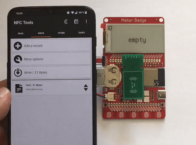
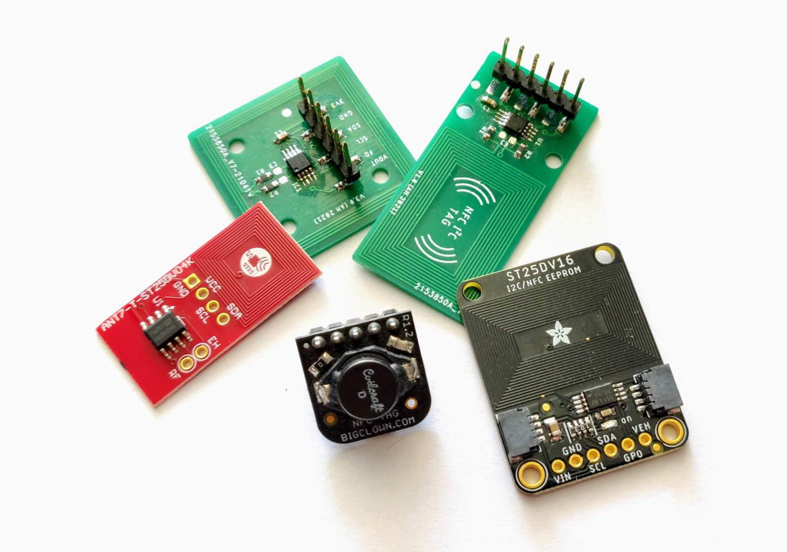

# Maker Badge NFC Addon

[Maker Badge](https://github.com/dronecz/maker_badge) by @dronecz is essentially a wearable device. However, it lacks Bluetooth Low Energy (BLE) support because the ESP32-S2 does not have it, making it difficult to communicate with your mobile phone. Using cables is inconvenient, and setting up WiFi can be bothersome. Fortunately, there is an even easier communication option available - **NFC**!

## Introduction

This project utilizes the NXP [NT3H2211](https://www.nxp.com/products/rfid-nfc/nfc-hf/connected-nfc-tags/ntag-ic-plus-2k-nfc-forum-type-2-tag-with-ic-interface:NTAG_I2C), which is essentially an I2C EEPROM memory on one side and an NFC tag on the other. It acts as a normal passive NFC tag, allowing you to use **any mobile application** (such as NFC Tools or NXP Tag Writer) to write textual NDEF records to it. The written text in form of `first line, second line, third line` will then be displayed on the device.

## HW

There are several options available for NFC tags, including the NXP NT3H2211, ST25DV04K from ST Micro, and others.

- NXP NT3H2211
    - [My PCB](https://twitter.com/horcicaa/status/1384975779650543619) (look into HW folder)
    - [NFC TAG from Hardwario](https://obchod.hardwario.cz/nfc-tag/)
- ST25DV04K
    - [ANT7-T-ST25DV04K Reference board for the ST25DV04K](https://www.st.com/en/evaluation-tools/ant7-t-st25dv04k.html)
    - [Adafruit ST25DV16K I2C RFID EEPROM Breakout](https://www.adafruit.com/product/4701)

*Note*: The ST25DV04K has a different memory layout than the NT3H2211 and is not supported in the current implementation. However, it should be relatively easy to extend the implementation to support this chip.

## Theory of opperation

The software is written in CircuitPython. Upon power-up, it will read the tag memory via I2C and attempt to locate an NDEF text message. 
If one is found, it will retrieve the text and display it on the device. 
Subsequently, it will set an alarm on the field detect pin of the NT3H2211 and enter deep sleep mode. When a phone with active NFC comes into proximity, it will wake up the badge.

If the field detect pin is not available (not connected on your PCB), one needs to make changes to periodically check if the memory content has changed. Alternatively, another option is to manually reset the badge via a button every time the memory has changed.

## Future improvements

- Expand support for other tags, not only the NT3H2211.
- Add support for NDEF format for business cards.
- Implement the ability to lock the tag (e.g., via a menu on the display). This feature would be particularly useful when supporting the business card format, ensuring that others can scan your badge to obtain contact information but cannot modify it.